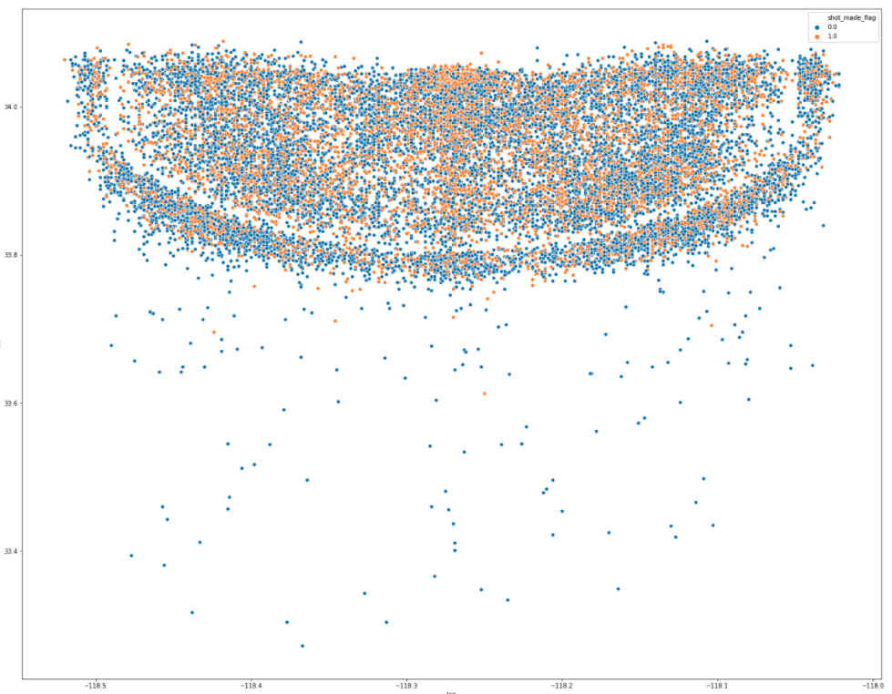
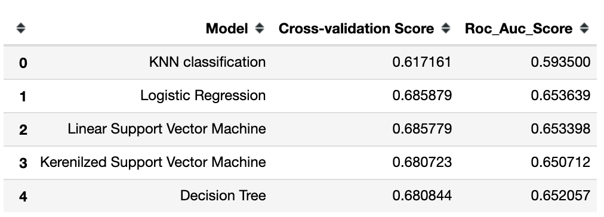

# Kaggle - Kobe Bryant Shot Classification
Kobe Bryant is an amazing basketball superstar in the NBA. He marked his retirement from the NBA by scoring 60 points in his final game as a Los Angeles Laker on Wednesday, April 12, 2016. Unfortunately, he passed away on January 26, 2020. As his fans, I would like to use my data analytic knowledge to analyze all his shot selection in a long career.

## Objective
Using the dataset to find the best model for predicting the next shot will make it or nor.

## Getting Started
I used four steps to achieve this submission.
* 1. Data Cleaning.\
     To polish my data clean skill, I randomly assign missing values into my dataset.
     Then, using histogram and the correlation across the dataset to find the trend or relationships among the dataset.
     After all data exploration, filling in missing values.
     
     
* 2. Modeling - Classification
      In this project, I will run following models and find out which model is the best fit for this dataset. (criteria: processing time and accuracy)
      1. KNN classification
      2. Logistic Regression
      3. Linear Support Vector Machine
      4. Kernelized Support Vector Machine (RBF, poly, and linear)
      5. Decision Tree.     

## Result
Based on the final roc auc score, performance of all models are similar, and Logistic Regression has the highest score.

